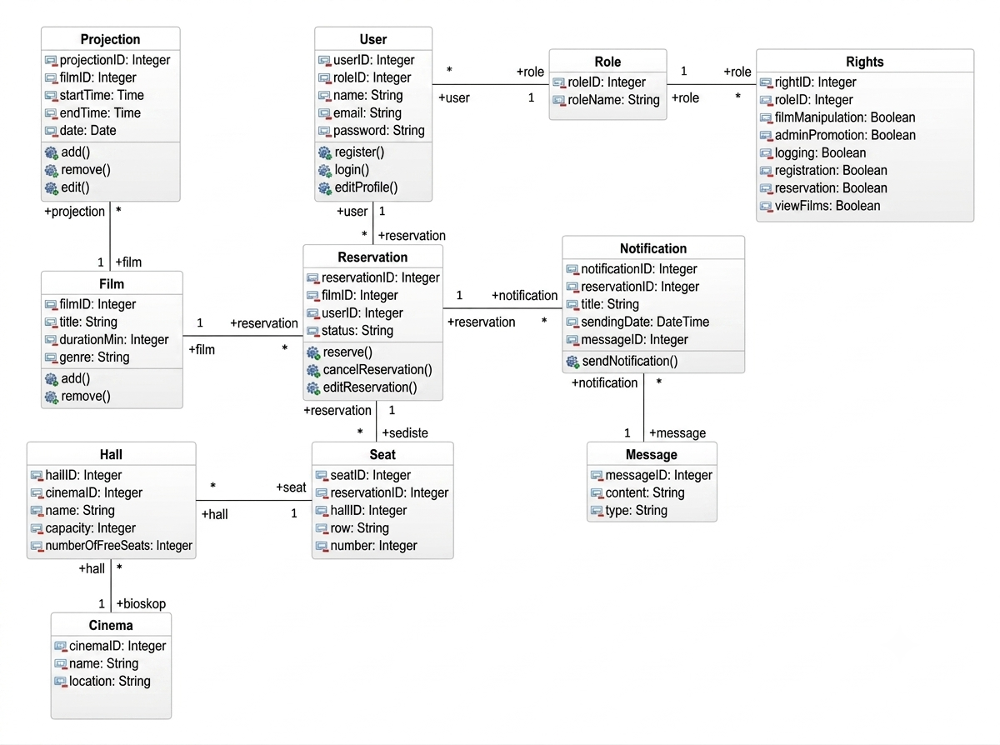
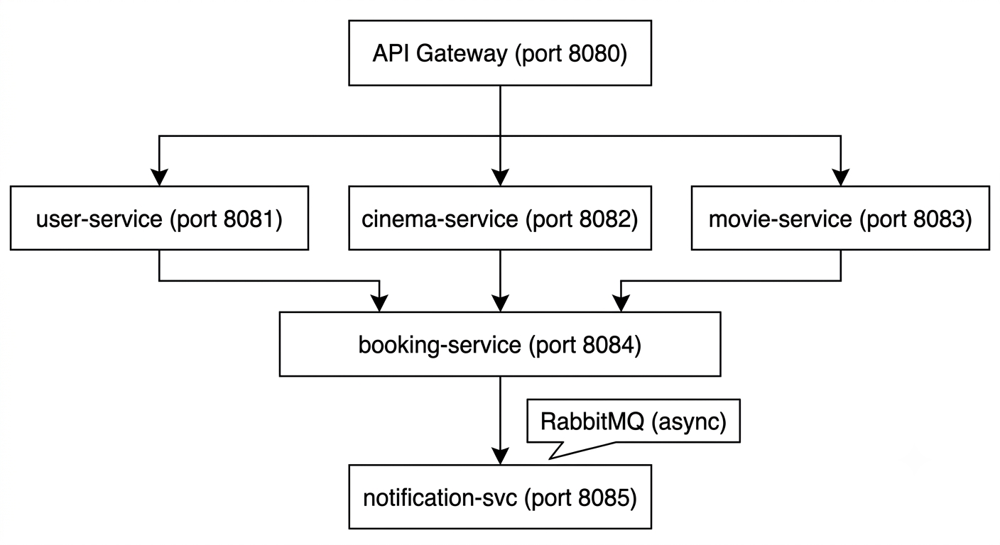
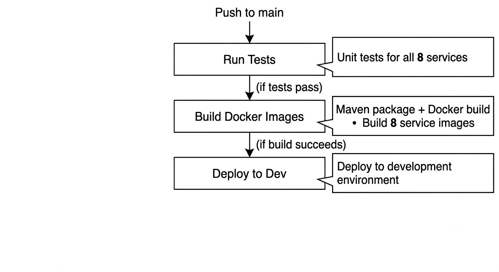

# Cinema Reservation System

The goal of this project was to build a cinema ticket reservation system using a microservices architecture with Spring Cloud. This was my first time working with microservices at this scale, and it turned out to be both challenging and really interesting — especially figuring out how all the services communicate with each other.

## About the Project

The system is split into 8 services — 3 infrastructure services and 5 business services. Each service has its own database, which is one of the core principles of microservices architecture (database per service pattern). Services communicate both synchronously (OpenFeign) and asynchronously (RabbitMQ).

One of the things I found most interesting during development was implementing JWT authentication from scratch and understanding how the token flows through the system on every request.

## Tech Stack

- Java 21, Spring Boot 3.2.4, Spring Cloud 2023.0.1
- PostgreSQL (separate database for each service)
- RabbitMQ for async messaging
- Spring Security + JWT for authentication
- Docker + Docker Compose for containerization
- GitHub Actions for CI/CD
- Netflix Eureka for service discovery
- Spring Cloud Gateway with Resilience4j Circuit Breaker
- Spring Cloud Config Server for centralized configuration

---

## Domain Model

The class diagram below shows the core domain entities and their relationships. The system revolves around a User making a Reservation for a Screening in a specific Seat, with Notifications sent upon confirmation or cancellation.



---

## Architecture

The diagram below shows how the services are connected. All client requests go through the API Gateway, which routes them to the appropriate service. The booking-service is the most central service — it communicates synchronously with user, cinema and movie services, and asynchronously with the notification service via RabbitMQ.



### Infrastructure Services

| Service | Port | Description |
|---------|------|-------------|
| discovery-server | 8761 | Eureka Service Registry — all services register here |
| config-server | 8888 | Centralized configuration for all services |
| api-gateway | 8080 | Single entry point with Circuit Breaker |

### Business Services

| Service | Port | Description |
|---------|------|-------------|
| user-service | 8081 | Registration, login, JWT, roles and permissions |
| cinema-service | 8082 | Cinemas, halls and seats management |
| movie-service | 8083 | Movies and screenings |
| booking-service | 8084 | Reservations — communicates with all other services |
| notification-service | 8085 | Email notifications via RabbitMQ |

---

## How the Services Work

### User Service
Handles registration and login. Passwords are encrypted with BCrypt and never stored as plain text. After login, the user receives a JWT token which needs to be sent with every subsequent request in the Authorization header.

### Cinema Service
Manages cinemas, halls and seats. One thing I automated here is seat generation — when you create a hall with a certain capacity, the seats are generated automatically, organized into rows (A through H). This saves a lot of manual data entry.

### Movie Service
Manages movies and screenings. A screening connects a movie to a hall on a specific date and time. The service only stores the hallId (not the full hall object) which keeps the services properly decoupled.

### Booking Service
This is the most complex service. When a booking is created, it:
1. Calls user-service to verify the user exists (synchronous — OpenFeign)
2. Calls movie-service to verify the screening exists (synchronous — OpenFeign)
3. Saves the booking with status CONFIRMED
4. Calls cinema-service to mark the seat as unavailable (synchronous — OpenFeign)
5. Sends a message to RabbitMQ so the notification service can send a confirmation email (asynchronous)

I chose RabbitMQ over Kafka for this because the notification use case is a simple task queue, not an event stream. Kafka would have been overkill here.

### Notification Service
Listens to the RabbitMQ queue and sends confirmation or cancellation emails to users. Because this is asynchronous, the booking service doesn't wait for the email to be sent — it just fires the message and moves on.

---

## Communication

| Type | Technology | Used Between |
|------|-----------|--------------|
| Synchronous | OpenFeign + Resilience4j | booking → user, movie, cinema |
| Asynchronous | RabbitMQ | booking → notification |

---

## Prerequisites

- Java 21
- Maven 3.9+
- Docker Desktop 24+
- Docker Compose v2

---

## Running the Application

1. Clone the repository:
```bash
git clone https://github.com/JovanovicNatasa/DIS_Cinema_Project.git
cd DIS_Cinema_Project
```

2. Create a `.env` file in the root directory:
```env
MAIL_USERNAME=your-email@gmail.com
MAIL_PASSWORD=your-gmail-app-password
```

3. Build all services:
```bash
cd cinema-parent
mvn clean package -DskipTests
cd ..
```

4. Start everything:
```bash
docker compose up --build
```

5. Check that services are running:
- Eureka Dashboard: http://localhost:8761 (eureka / eureka-secret)
- RabbitMQ Management: http://localhost:15672 (guest / guest)
- API Gateway: http://localhost:8080

### Stopping
```bash
# Stop services
docker compose down

# Stop and remove all data
docker compose down -v
```

---

## API Endpoints

All requests go through the API Gateway on port 8080. For protected endpoints, include the JWT token in the header:
```
Authorization: Bearer <your-token>
```

### User Service (`/api/users`)

| Method | Endpoint | Description | Auth Required |
|--------|----------|-------------|---------------|
| POST | `/api/users/register` | Register new user | No |
| POST | `/api/users/login` | Login and receive JWT token | No |
| GET | `/api/users` | Get all users | Yes |
| GET | `/api/users/{id}` | Get user by ID | Yes |
| DELETE | `/api/users/{id}` | Delete user | Yes |

### Cinema Service (`/api/cinemas`)

| Method | Endpoint | Description | Auth Required |
|--------|----------|-------------|---------------|
| POST | `/api/cinemas` | Create cinema | Yes |
| GET | `/api/cinemas` | Get all cinemas | Yes |
| GET | `/api/cinemas/{id}` | Get cinema by ID | Yes |
| DELETE | `/api/cinemas/{id}` | Delete cinema | Yes |
| POST | `/api/cinemas/halls` | Create hall (auto-generates seats) | Yes |
| GET | `/api/cinemas/{id}/halls` | Get halls by cinema | Yes |
| GET | `/api/cinemas/halls/{id}/seats` | Get all seats in a hall | Yes |
| GET | `/api/cinemas/halls/{id}/seats/available` | Get available seats | Yes |

### Movie Service (`/api/movies`)

| Method | Endpoint | Description | Auth Required |
|--------|----------|-------------|---------------|
| POST | `/api/movies` | Create movie | Yes |
| GET | `/api/movies` | Get all movies | Yes |
| GET | `/api/movies/{id}` | Get movie by ID | Yes |
| GET | `/api/movies/search?title=` | Search by title | Yes |
| GET | `/api/movies/genre/{genre}` | Filter by genre | Yes |
| DELETE | `/api/movies/{id}` | Delete movie | Yes |
| POST | `/api/movies/screenings` | Create screening | Yes |
| GET | `/api/movies/screenings` | Get all screenings | Yes |
| GET | `/api/movies/{id}/screenings` | Get screenings for a movie | Yes |

### Booking Service (`/api/bookings`)

| Method | Endpoint | Description | Auth Required |
|--------|----------|-------------|---------------|
| POST | `/api/bookings` | Create a booking | Yes |
| GET | `/api/bookings` | Get all bookings | Yes |
| GET | `/api/bookings/{id}` | Get booking by ID | Yes |
| GET | `/api/bookings/user/{userId}` | Get bookings for a user | Yes |
| PUT | `/api/bookings/{id}/cancel` | Cancel a booking | Yes |

---

## CI/CD Pipeline

The pipeline runs automatically on every push to the main branch (tests, build, and development deployment). Production deployment is a separate, manually triggered stage — see below. I set this up with GitHub Actions — it was actually simpler than I expected once I understood the YAML syntax.



| Stage | What it does |
|-------|-------------|
| Run Tests | Runs unit tests (JUnit 5 + Mockito) for all 8 services, plus Testcontainers integration tests for 4 of them |
| Build Docker Images | Builds Maven JARs and Docker images |
| Deploy to Development | Deploys to the development environment |
| Deploy to Production | Manually triggered deployment to production with required approval |

### Production Deployment

The production deployment stage is triggered manually through GitHub Actions (`workflow_dispatch`), 
not automatically on every push. This reflects standard practice where production deploys require 
a deliberate decision, unlike development deploys which run on every push to `main`.

The `production` environment is protected with required reviewers in GitHub — when a production 
deployment is requested, it pauses and waits for manual approval before proceeding.

### GitHub Secrets needed

| Secret | Description |
|--------|-------------|
| `MAIL_USERNAME` | Gmail address used for sending notifications |
| `MAIL_PASSWORD` | Gmail App Password (not your regular Gmail password) |

---

## Testing

Each business service has unit tests. The tests use Mockito to mock dependencies so there's no need for a real database when running them.

```bash
# Run tests for one service
cd user-service
mvn test

# Run tests for all services at once
cd cinema-parent
mvn test
```

### Integration Tests

Four of the business services (user, cinema, movie, booking) also have integration tests that 
use Testcontainers to spin up a real PostgreSQL container during test execution. This verifies 
actual database behavior (constraints, sequences, real SQL dialect) rather than relying on mocks.

For booking-service specifically, the Feign clients (calls to user, movie and cinema services) 
and the RabbitTemplate are mocked, since the other microservices and RabbitMQ aren't running 
during the test — only the database interaction is tested for real.

```bash
# Run integration tests for a specific service (requires Docker running)
cd user-service
mvn test -Dtest=UserServiceIntegrationTest
```

---

## Project Structure

```
cinema/
├── .github/workflows/ci-cd.yml
├── cinema-parent/pom.xml
├── discovery-server/
├── config-server/
│   └── src/main/resources/configs/
│       ├── user-service.yml
│       ├── cinema-service.yml
│       ├── movie-service.yml
│       ├── booking-service.yml
│       ├── notification-service.yml
│       └── api-gateway.yml
├── api-gateway/
├── user-service/
├── cinema-service/
├── movie-service/
├── booking-service/
├── notification-service/
├── docs/images/
│   ├── Architecture.png
│   ├── ClassDiagram.png
│   └── CICDPipeline.png
├── docker-compose.yml
└── .env  ← not committed to git
```

---

## Author

Natasa Jovanovic